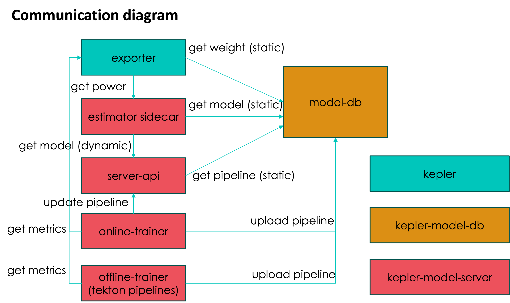

# Kepler Power Model

[Get started with Kepler Model Server.](https://sustainable-computing.io/kepler_model_server/get_started/)

This repository contains source code related to Kepler power model. The modules in this repository connects to [core Kepler project](https://github.com/sustainable-computing-io/kepler) and [kepler-model-db](https://github.com/sustainable-computing-io/kepler-model-db) as below.



For more details, check [the component diagram](./fig/model-server-components-simplified.png).

## Model server and estimator deployment

### Using Kepler Operator

```yaml
apiVersion: kepler.system.sustainable.computing.io/v1alpha1
kind: KeplerInternal
metadata:
  name: kepler
spec:
..
  modelServer:
    enabled: <true|false>
  estimator:
    node:
      components:
        sidecar: <true|false>
        initUrl: <static model URL>
      total:
        sidecar: <true|false>
        initUrl: <static model URL>
```

### Using manifests with setup script

Deploy with estimator sidecar

```bash
OPTS="ESTIMATOR" make deploy
```

Deploy with estimator sidecar and model server

```bash
OPTS="ESTIMATOR SERVER" make deploy
```

## Model Training

- [Use Tekton pipeline](./model_training/tekton/README.md)

## Local test

### Via docker

1. Build image for testing, run

    ```bash
    make build-test
    ```

2. Run the test

    |Test case|Command|
    |---|---|
    |[Training pipeline](./tests/README.md#pipeline)|make test-pipeline|
    |[Model server](./tests/README.md#estimator-model-request-to-model-server)|make test-model-server|
    |[Estimator](./tests/README.md#estimator-power-request-from-collector)|make test-estimator|
    |[Offline Trainer](./tests/README.md#offline-trainer)|make test-offline-trainer|

    For more test information, check [here](./tests/).

### With native python environment

Compatible version: `python 3.10`

1. Install [`hatch`](https://hatch.pypa.io/latest/install/)
2. Prepare environment

    ```bash
    hatch shell
    ```

3. Run the test

| Test case                   | Command                                                                                                                                                                                                                                                                        |
|-----------------------------|--------------------------------------------------------------------------------------------------------------------------------------------------------------------------------------------------------------------------------------------------------------------------------|
| [Training pipeline](./tests/README.md#pipeline)| python -u ./tests/pipeline_test.py                                                                                                                                                                                                                                             |
| [Model server](./tests/README.md#estimator-model-request-to-model-server)| Terminal 1: export MODEL_PATH=$(pwd)/tests/models;python src/server/model_server.py Terminal 2: python -u tests/estimator_model_request_test.py                                                                                                                                |
| [Estimator](./tests/README.md#estimator-power-request-from-collector) | Terminal 1: python src/estimate/estimator.py Terminal 2: python -u tests/estimator_power_request_test.py                                                                                                                                                                       |
| Estimator with Model Server | Terminal 1: export MODEL_PATH=$(pwd)/tests/models;python src/server/model_server.py Terminal 2: export MODEL_SERVER_URL=<http://localhost:8100>;export MODEL_SERVER_ENABLE=true;python -u src/estimate/estimator.py Terminal 3: python -u tests/estimator_power_request_test.py |
| [Offline Trainer](./tests/README.md#offline-trainer) | Terminal 1: python src/train/offline_trainer.py Terminal 2: python -u tests/offline_trainer_test.py                                                                                                                                                                            |

  For more test information, check [here](./tests/).

### Contributing

Please check the roadmap and guidelines to join us [here](./contributing.md).
