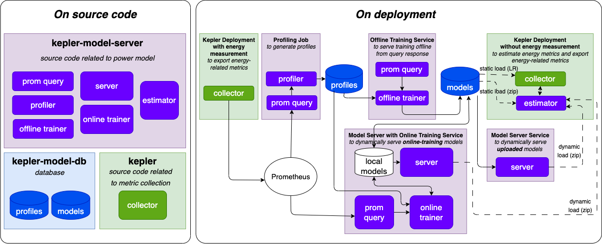

# Kepler Power Model
[Get started with Kepler Model Server.](https://sustainable-computing.io/kepler_model_server/get_started/)

This repository contains source code related to Kepler power model. The modules in this reposioty connects to [core Kepler project](https://github.com/sustainable-computing-io/kepler) and [kepler-model-db](https://github.com/sustainable-computing-io/kepler-model-db) as below.


## Deployment

Deploy with estimator sidecar
```
OPTS="ESTIMATOR" make deploy
```

Deploy with estimator sidecar and model server 
```
OPTS="ESTIMATOR SERVER" make deploy
```

## Local test
### via docker
1. Build image for testing, run 
    ```
    make build-test
    ```

2. Run the test

    |Test case|Command|
    |---|---|
    |[Training pipeline](./tests/README.md#pipeline)|make test-pipeline|
    |[Model server](./tests/README.md#estimator-model-request-to-model-server)|make test-model-server|
    |[Estimator](./tests/README.md#estimator-power-request-from-collector)|make test-estimator|
    |[Offline Trainer](./tests/README.md#offline-trainer)|make test-offline-trainer|

    For more test information, check [here](./tests/).

### with native python (3.8+) environment
1. Prepare environment

    ```bash
    pip install -r ../dockerfiles/requirements.txt
    ```

2. Run the test

    |Test case|Command|
    |---|---|
    |[Training pipeline](./tests/README.md#pipeline)|python -u ./tests/pipeline_test.py|
    |[Model server](./tests/README.md#estimator-model-request-to-model-server)|Terminal 1: python src/server/model_server.py <br>Terminal 2: python -u tests/estimator_model_request_test.py|
    |[Estimator](./tests/README.md#estimator-power-request-from-collector)|Terminal 1: python src/estimate/estimator.py<br>Terminal 2: python -u tests/estimator_power_request_test.py|
    |[Offline Trainer](./tests/README.md#offline-trainer)|Terminal 1: python src/train/offline_trainer.py<br>Terminal 2: python -u tests/offline_trainer_test.py|

    For more test information, check [here](./tests/).

### Contributing
Please check the roadmap and guidelines to join us [here](./contributing.md).
