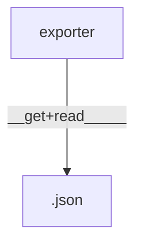
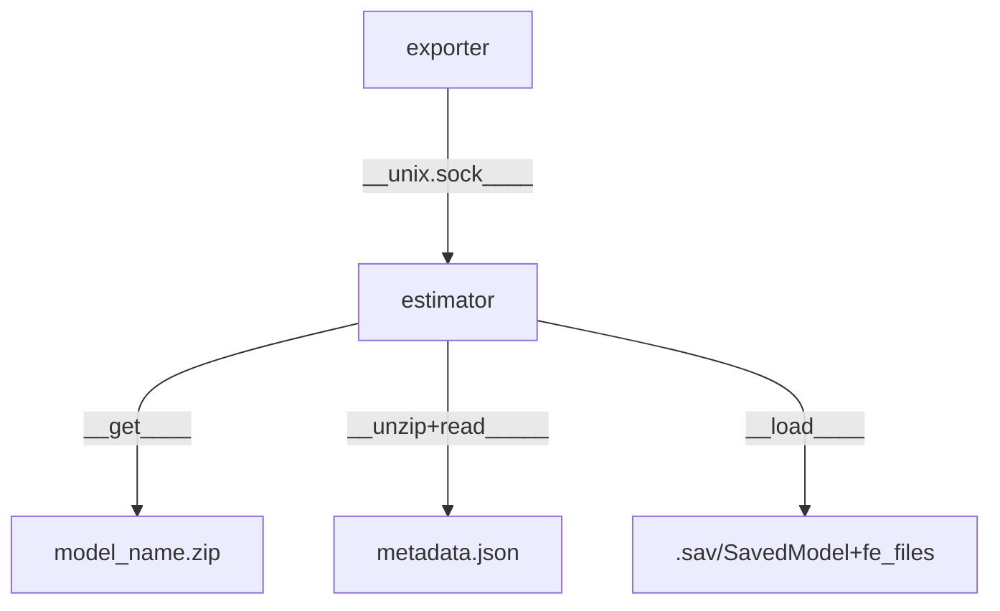
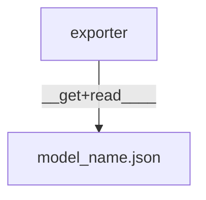
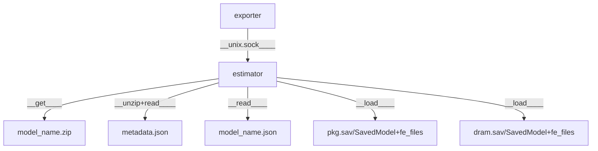

<!-- vscode-markdown-toc -->
- [Model Path](#model-path)
	- [Metadata](#metadata)
	- [Model Content](#model-content)
		- [1. Model Weight for Linear Regression](#1-model-weight-for-linear-regression)
		- [2. Archived Model](#2-archived-model)
		- [3. Component Model](#3-component-model)
			- [3.1. Model Weight](#31-model-weight)
			- [3.2. Archived Model](#32-archived-model)

# Model Path

**path strucure:**
```bash
├── ModelOutputType
│   ├── FeatureGroup
│       ├── ModelName
│           ├── metadata.json
│           ├── [model content]
```

- Check [ModelOutputType](./model_output.md) and [FeatureGroup](./model_feature.md)
- model content is different for each kind of output type and learning pipeline

## Metadata

field|description
---|---
model_name| unique name (same as ModelName)
model_class| learning library (currently support only keras and scikit)
output_type | model output type (same as ModelOutputType)
model_file| model filename to be loaded depends on output_type and model_class (.json, .sav, .h5, saved model folder etc.)
features| list of metrics using as input
fe_files| list of transformer objects saved in .pkl including as scaler, polynomial transformer, and any feature engineering object that implements transform function
mae | mean absolute error, default error key for model selection

<!-- vscode-markdown-toc-config
	numbering=true
	autoSave=true
	/vscode-markdown-toc-config -->
<!-- /vscode-markdown-toc -->

## Model Content
https://sustainable-computing.io/design/power_estimation/

###  1. <a name='ModelWeightforLinearRegression'></a>Model Weight for Linear Regression
The model file is saved in json format and will be applied by local linear regression estimator.



[source code](../pkg/model/estimator/local/lr.go)

```python
/*
ModelWeights, AllWeight, CategoricalFeature, NormalizedNumericalFeature define structure of model weight
{
"All_Weights":
		{
		"Bias_Weight": 1.0,
		"Categorical_Variables": {"cpu_architecture": {"Sky Lake": {"weight": 1.0}}},
		"Numerical_Variables": {"cpu_cycles": {"mean": 0, "variance": 1.0, "weight": 1.0}}
		}
}
*/
type ModelWeights struct {
	AllWeights `json:"All_Weights"`
}
type AllWeights struct {
	BiasWeight           float64                                  `json:"Bias_Weight"`
	CategoricalVariables map[string]map[string]CategoricalFeature `json:"Categorical_Variables"`
	NumericalVariables   map[string]NormalizedNumericalFeature    `json:"Numerical_Variables"`
}
type CategoricalFeature struct {
	Weight float64 `json:"weight"`
}
type NormalizedNumericalFeature struct {
	Mean     float64 `json:"mean"`
	Variance float64 `json:"variance"`
	Weight   float64 `json:"weight"`
}
```

###  2. <a name='ArchivedModel'></a>Archived Model
The model file can be saved in multiple format depends on model class. The model will be applied by [genearl estimator sidecar](https://github.com/sustainable-computing-io/kepler-estimator). The sidecar is called by [Kepler EstimatorSidecarConnector](https://github.com/sustainable-computing-io/kepler/blob/main/pkg/model/estimator/sidecar/estimate.go#L83).

- scikit: the model is saved in `.sav`.
- keras: the model is saved as TensorFlow SavedModel format (folder).

> Any archive-type model will be exported as an archived zip file.



###  3. <a name='ComponentModel'></a>Component Model
When the model is trained separately for each power component (e.g., pkg, dram), the main model file is saved in json format that keeps a map of component label and the model content of that component. The common model file name is `[model_name].json`

####  3.1. <a name='ModelWeight'></a>Model Weight

```python
/*
ComponentModelWeights defines structure for multiple (power component's) weights
{
"pkg":
	{"All_Weights":
	  {
	  "Bias_Weight": 1.0,
	  "Categorical_Variables": {"cpu_architecture": {"Sky Lake": {"weight": 1.0}}},
	  "Numerical_Variables": {"cpu_cycles": {"mean": 0, "variance": 1.0, "weight": 1.0}}
	  }
	},
"dram":
	{"All_Weights":
	  {
	  "Bias_Weight": 1.0,
	  "Categorical_Variables": {"cpu_architecture": {"Sky Lake": {"weight": 1.0}}},
	  "Numerical_Variables": {"cache_miss": {"mean": 0, "variance": 1.0, "weight": 1.0}}
	  }
	}
}
*/
type ComponentModelWeights map[string]ModelWeights
```




####  3.2. <a name='ArchivedModel-1'></a>Archived Model
```python
{
    "pkg": {pkg model metadata; e.g., model_name: "pkg.sav"},
    "dram": {dram model metadata; e.g., model_name: "dram.sav"}
}
```


