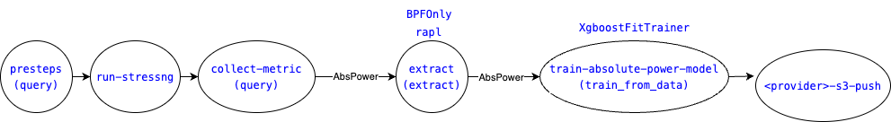
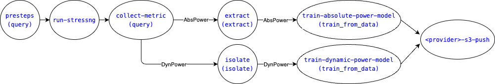
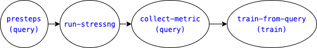

# Kepler power model training with Tekton
Previous step: [Prepare cluster](./README.md#1-prepare-cluster)

<!-- TOC tocDepth:2..3 chapterDepth:2..6 -->

- [1. Prepare resource](#1-prepare-resource)
- [2. Deploy Tekton tasks and pipelines](#2-deploy-tekton-tasks-and-pipelines)
- [3. Run Tekton pipeline](#3-run-tekton-pipeline)
- [Advanced Step: customize the pipelinerun](#advanced-step-customize-the-pipelinerun)
    - [Single train run](#single-train-run)
    - [Original complete run](#original-complete-run)

<!-- /TOC -->

## 1. Prepare resource
1. Install Tekton

    ```bash
    kubectl apply --filename https://storage.googleapis.com/tekton-releases/pipeline/latest/release.yaml
    ```

    > official guideline: https://tekton.dev/docs/installation/pipelines/

2. Deploy PersistentVolumeClaim `task-pvc` for workspace
    
    For simple hostpath,
    ```
    kubectl apply -f pvc/hostpath.yaml
    ```

    > The query, preprocess data, and models will be mounted to the hostpath: `/mnt`

3. Update secret for S3 bucket (optional)

    3.1. Set required environment variables and deploy secret for S3 regarding the provider

    For IBM Cloud:
    ```yaml
    apiVersion: v1
    kind: Secret
    metadata:
        name: ibm-cos-secret
        type: Opaque
    stringData:
        accessKeyID: ${AWS_ACCESS_KEY_ID}
        accessSecret: ${AWS_SECRET_ACCESS_KEY}
        regionName: ${AWS_REGION}
        bucketName: kepler-power-model
    ```

    For AWS:
    ```yaml
    apiVersion: v1
    kind: Secret
    metadata:
        name: aws-cos-secret
        type: Opaque
    stringData:
        serviceEndpoint: ${IBMCLOUD_SERVICE_ENDPOINT}
        apiKey: ${IBMCLOUD_API_KEY}
        serviceInstanceID: ${IBMCLOUD_SERVICE_INSTANCE_ID}
        bucketName: kepler-power-model
    ```

    3.2. Uncomment COS-related varaiable values in `pipelineruns/kepler-default.yaml`

## 2. Deploy Tekton tasks and pipelines

```
kubectl apply -f tasks
kubectl apply -f tasks/s3-pusher
kubectl apply -f pipelines
```

## 3. Run Tekton pipeline

The minimum required pipelinerun for default power model of Kepler on VM is as below:


```
kubectl apply -f pipelineruns/kepler-default.yaml
```
> If the secret is not deployed and not specified, the s3-push step will be skipped. 

## Advanced Step: customize the pipelinerun

The defined tasks can be reused for the various training runs based on two availble pipelines: single-train and complete-train as follows.

### Single train run
A single flow to apply a set of trainers to specific feature group and energy source.



check [single-train](./pipelines/single-train.yaml) pipeline.
> If the secret is not deployed and not specified, the s3-push step will be skipped. 

Example for AbsPower model:
    
```
kubectl apply -f pipelineruns/abs-train-pipelinerun.yaml
```

Example of DynPower model:

```
kubectl apply -f pipelineruns/dyn-train-pipelinerun.yaml
```

To customize feature metrics, set

parameters|value
---|---
THIRDPARTY_METRICS|customized metric list (use comma as delimiter)
FEATURE_GROUP|`ThirdParty`

To customize stressng workload, set
parameters|value
---|---
STRESS_BREAK_INTERVAL|break interval between each stress load
STRESS_TIMEOUT|stress duration (timeout to stop stress)
STRESS_ARGS|array of arguments for CPU frequency and stressng workload<br>- `STRESS_LOAD;STRESS_EXTRA_PARAM_KEYS;STRESS_EXTRA_PARAM_VALS`<br>* use `none` if not applicable for `STRESS_EXTRA_PARAM_KEYS`, and `STRESS_EXTRA_PARAM_VALS`<br>* `CPU_FREQUENCY` and `STRESS_INSTANCE` variation range will be automatic computed by machine CPU info.

To customize preprocessing and training components
parameters|value
---|---
PIPELINE_NAME|pipeline name (output prefix/folder)
EXTRACTOR|extractor class (default or smooth)
ISOLATOR|isolator class (none, min, profile, or trainer)<br> For trainer isolator, ABS_PIPELINE_NAME must be set to use existing trained pipeline to estimate background power.
TRAINERS|list of trainer classes (use comma as delimiter)

### Original complete run
Apply a set of trainers to all available feature groups and energy sources



check [complete-train](./pipelines/complete-train.yaml) pipeline.
> If the secret is not deployed and not specified, the s3-push step will be skipped. 

```
kubectl apply -f pipelineruns/complete-pipelinerun.yaml
```

To customize `ThirdParty` feature group, set
parameters|value
---|---
THIRDPARTY_METRICS|customized metric list (use comma as delimiter)

Stressng load can be set similarly to [single train run](#single-train-run).

To customize pipeline components, `PIPELINE_NAME`, `EXTRACTOR`, `ISOLATOR`, and `ABS_PIPELINE_NAME` can be set similarly to [single train run](#single-train-run).

Instead of `TRAINERS`, original pipeline run use `ABS_TRAINERS` and `DYN_TRAINERS` to specify the list for trainers for AbsPower training and DynPower training respectively.